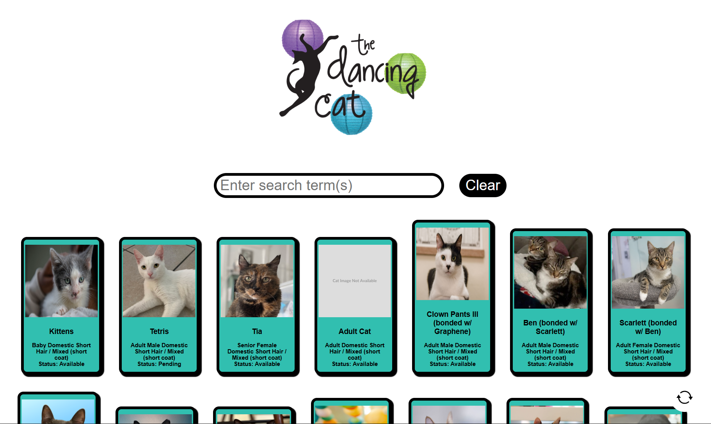

# Catz: The Dancing Cats Data management UI



This repo is a UI interface for rescuegroups.org API. Made for the dancing cats

It can:
- Live search with minimal API requests
- display cat journals and files
- Mass copy multiple journals to multiple cats to reduce time spent by volunteers
- Mass upload files with automatic identification of image and document (with option to change if needed)

## How to use

**Step 1**: Install dependencies

First make sure you have node by doing `node -v` (if you dont check the [official website](https://nodejs.org/en))

**For the data API**:
```bash
cd data_api
npm install express json request
```

**For interface:**
```bash
npm install -g vue vue-router
npm install concurrently
```

**Step 2**: Add config files

inside `/data_api/` add a `config.json` file and fill it as follows:
```json
{
    "SECRET_KEY":"",
	"RESCUE_GROUPS_USERNAME": "",
	"RESCUE_GROUPS_PASSWORD" : "",
	"RESCUE_GROUPS_ACCOUNT_NUMBER" : ,
	"TEMPLATE_FILE_ID" : "",
	"TARGET_FOLDER_ID" : "",
    "BASE_URL" : ""
}

```

**Step 3**: Running

Doing `vue serve` should run a development server version of the code


